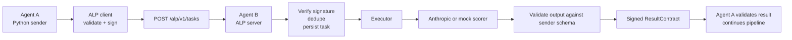
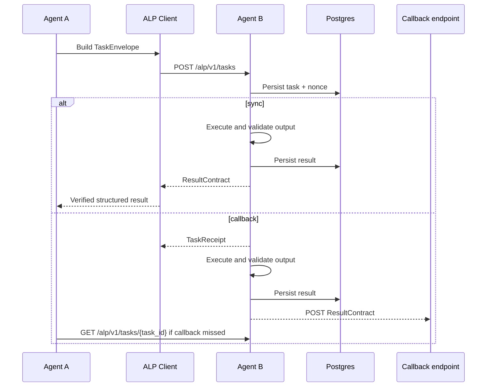

# ALP v1

ALP v1, short for AgentLink Protocol, is a small delegation layer for agent-to-agent work.

One agent sends a signed task with a declared result schema. Another agent verifies it, executes it, persists state, and returns a signed result or a typed failure. The point is to make delegation reliable across different runtimes without depending on prompt formatting, regex cleanup, or framework-specific glue.

## What this repo ships

| Part | Path | Purpose |
| --- | --- | --- |
| Protocol schemas | [`schemas`](./schemas) | Source of truth for `TaskEnvelope`, `TaskReceipt`, and `ResultContract` |
| Python runtime | [`python/src/alp`](./python/src/alp) | Sender client, FastAPI server, signing, validation, Postgres and SQLite stores |
| TypeScript runtime | [`typescript/src`](./typescript/src) | Sender client, Fastify server, signing, validation, Postgres and file stores |
| Reference sender | [`python/examples/research_agent.py`](./python/examples/research_agent.py) | Agent A generates ideas with OpenAI or mock logic, delegates them, and aggregates results |
| Reference receiver | [`typescript/examples/scoring-agent.ts`](./typescript/examples/scoring-agent.ts) | Agent B scores ideas with Anthropic tool use or mock logic |
| Postgres migrations | [`sql/migrations`](./sql/migrations) | Versioned schema used by both runtimes |
| Local stack | [`docker-compose.yml`](./docker-compose.yml) | Postgres, Agent A, and Agent B |
| Smoke scripts | [`scripts/e2e_mock.sh`](./scripts/e2e_mock.sh), [`scripts/provider_smoke.sh`](./scripts/provider_smoke.sh) | End-to-end verification |
| Hosted deploy guide | [`docs/deploy/railway.md`](./docs/deploy/railway.md) | Concrete Railway deployment path |

## What ALP is useful for

- A planner delegating structured scoring, ranking, or extraction to a specialist agent.
- A Python service handing work to a TypeScript service without inventing a custom protocol.
- Teams that need durable async callbacks, status polling, idempotency, and signed results.
- Multi-agent systems where the receiver model or framework may change but the result contract cannot.

## Architecture





## Runtime model

- The ALP wire protocol is stable in this repo: `TaskEnvelope`, `TaskReceipt`, and `ResultContract` stay schema-compatible.
- Postgres is the deployable store. SQLite and file stores remain available for local tests and fallback development runs.
- The reference agents support two modes:
  - `mock`: deterministic local execution with no provider keys.
  - `provider`: OpenAI on Agent A and Anthropic on Agent B.

## Quick start

### 1. Install local dependencies

```bash
python3 -m pip install -e './python[dev]'
cd typescript && npm install && cd ..
```

### 2. Generate a local `.env`

```bash
python3 scripts/generate_dev_keys.py
```

This writes a development `.env` from [`.env.example`](./.env.example) with fresh Ed25519 keys and a random Postgres password. It leaves provider API keys and model IDs as placeholders.

### 3. Run tests

```bash
python3 -m pytest python/tests
cd typescript && npm test && npm run build && cd ..
```

### 4. Run the full mock stack in Docker

```bash
docker compose up --build
```

Then call the pipeline:

```bash
curl -sS -X POST http://127.0.0.1:8000/demo/pipeline/sync \
  -H 'content-type: application/json' \
  -d '{"prompt":"Find the next MCP or RAG infrastructure startup idea","context":"Focus on reliability, monetizable pain, and agent workflows."}'
```

Async flow:

```bash
curl -sS -X POST http://127.0.0.1:8000/demo/pipeline/async \
  -H 'content-type: application/json' \
  -d '{"prompt":"Generate AI infrastructure ideas for developer tools","context":"Prefer products that can delegate to specialist agents."}'
```

### 5. Run the local smoke script

```bash
bash scripts/e2e_mock.sh
```

### 6. Run the provider smoke script

Fill in real provider credentials in `.env`, set `ALP_EXECUTOR_MODE=provider`, then run:

```bash
bash scripts/provider_smoke.sh
```

## HTTP surface

Core receiver routes:

- `POST /alp/v1/tasks`
- `GET /alp/v1/tasks/{task_id}`
- `GET /healthz`
- `GET /readyz`
- `GET /metrics`

Reference sender routes:

- `POST /demo/pipeline/sync`
- `POST /demo/pipeline/async`
- `POST /callbacks/result`
- `GET /demo/result/{task_id}`

## Example task flow

1. Agent A accepts a user prompt and generates 3 to 5 ideas using OpenAI structured output or deterministic mock logic.
2. Agent A sends those ideas to Agent B as a signed `TaskEnvelope`.
3. Agent B verifies the task, persists it, scores the ideas, validates the result against the original sender schema, and signs the `ResultContract`.
4. Agent A verifies the signature and schema again, ranks the returned ideas, and either responds immediately or exposes the result through callback retrieval.

## Security and reliability rules

- Every task and result is signed with Ed25519.
- The receiver persists task state before execution.
- Nonces and `(issuer, task_id)` pairs are idempotent and conflict-checked.
- Successful results are only emitted after schema validation against the sender’s declared `expected_output_schema`.
- Callback delivery is retried on a fixed schedule and missed callbacks remain retrievable through `GET /alp/v1/tasks/{task_id}`.
- Placeholder keys are rejected outside development mode.

## Deployment

The main deploy path is Docker plus Postgres. A concrete hosted path for the same containers is documented in [Railway deployment](./docs/deploy/railway.md).

## Verification status

Verified in this repo:

- Python tests: `python3 -m pytest python/tests`
- TypeScript tests: `cd typescript && npm test && npm run build`
- Local mock end-to-end over HTTP by running Agent A and Agent B directly and exercising both sync and async pipeline routes

Not verified in this session:

- Docker Compose smoke run, because the local Docker daemon was not available
- Live provider mode, because no real OpenAI or Anthropic credentials were configured

## Good entry points

1. [`schemas/task-envelope.v1.json`](./schemas/task-envelope.v1.json)
2. [`python/src/alp/client.py`](./python/src/alp/client.py)
3. [`python/src/alp/server.py`](./python/src/alp/server.py)
4. [`python/src/alp/store.py`](./python/src/alp/store.py)
5. [`typescript/src/server.ts`](./typescript/src/server.ts)
6. [`typescript/src/store.ts`](./typescript/src/store.ts)

## Not in v1

- No registry or service discovery
- No marketplace or billing layer
- No multi-hop delegation
- No consensus or voting protocol
- No prompt-only JSON extraction fallback
- No streaming transport
- No workflow engine
