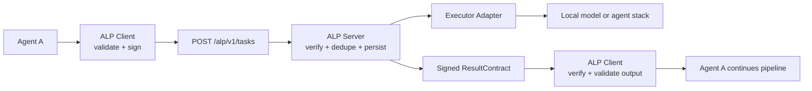
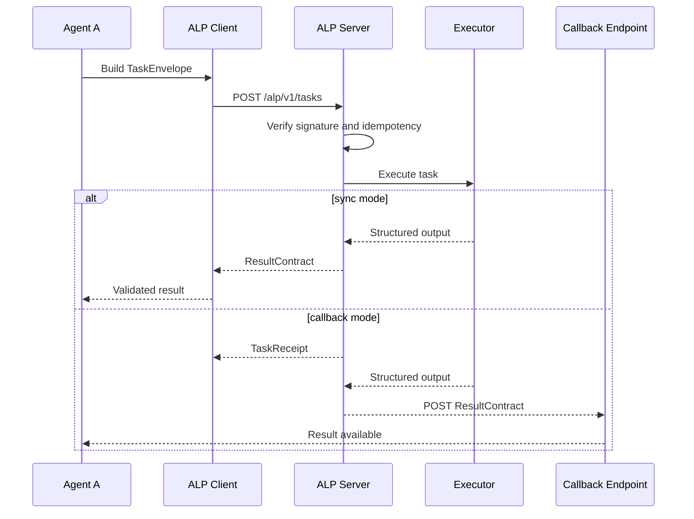

# ALP v1 🤝


ALP v1, short for AgentLink Protocol, is a delegation contract for agent to agent work.

One agent sends a signed task with a declared result schema.
Another agent accepts it, validates it, runs the task, and returns a signed result or a typed failure.

This repo exists to solve one practical problem:

> how do two agents hand work to each other without prompt hacks, regex parsing, or framework specific glue

## ✨ What this is good for

| Use case | Agent A | Agent B | Why ALP helps |
| --- | --- | --- | --- |
| Research pipelines | Planner | Scorer or ranker | Agent A can outsource scoring and trust the returned shape |
| Extraction jobs | General assistant | Structured extractor | Output contract stays stable even if the executor model changes |
| Tool routing | Orchestrator | Specialist worker | Clear sync or callback behavior with typed failures |
| Multi service agent systems | One runtime | Another runtime | Python and TypeScript can interoperate without custom glue |
| Cost control | Premium model | Cheaper specialist | Delegation stays reliable instead of becoming string parsing |

## 🧭 What ships in this repo

| Part | Path | Notes |
| --- | --- | --- |
| Protocol schemas | [`schemas`](schemas) | Source of truth JSON Schemas for `TaskEnvelope`, `TaskReceipt`, and `ResultContract` |
| Python SDK and server | [`python/src/alp`](python/src/alp) | Pydantic models, signing, validation, FastAPI receiver, SQLite demo store |
| TypeScript SDK and server | [`typescript/src`](typescript/src) | Runtime types, signing, validation, Fastify receiver, file backed demo store |
| Python demo caller | [`python/examples/research_agent.py`](python/examples/research_agent.py) | Agent A, sync and async demo endpoints |
| TypeScript demo receiver | [`typescript/examples/scoring-agent.ts`](typescript/examples/scoring-agent.ts) | Agent B, heuristic scoring executor |
| Compose setup | [`docker-compose.yml`](docker-compose.yml) | Two service local demo |
| Postgres schema draft | [`sql/postgres.sql`](sql/postgres.sql) | Production oriented table layout |

## 🏗️ How ALP works



## 🔄 Sync and callback flow



## 🔐 Reliability rules

1. Every task is schema checked before it leaves the sender.
2. Every request and result is signed with Ed25519.
3. Every receiver stores task state before execution.
4. Every result is validated against the original expected output schema.
5. Duplicate task ids are safe when the logical payload matches.
6. Callback delivery retries on a schedule instead of disappearing silently.
7. Typed failures travel back as data instead of becoming transport surprises.

## 🧪 Quick start

### 1. Install everything

```bash
python3 -m pip install -e './python[dev]'
cd typescript && npm install && cd ..
```

### 2. Run the test suite

```bash
python3 -m pytest python/tests
cd typescript && npm test && npm run build && cd ..
```

### 3. Start the demo without Docker

Terminal one

```bash
cd typescript
npm run start:agent-b
```

Terminal two

```bash
python3 python/examples/research_agent.py
```

### 4. Trigger a sync delegation

```bash
curl -sS -X POST http://127.0.0.1:8000/demo/score-sync \
  -H 'content-type: application/json' \
  -d '{}'
```

### 5. Trigger an async delegation

```bash
curl -sS -X POST http://127.0.0.1:8000/demo/score-async \
  -H 'content-type: application/json' \
  -d '{}'
```

### 6. Run the two service setup with Docker

```bash
docker compose up --build
```

## 📦 What the demo proves

1. A Python agent can delegate to a TypeScript agent over real HTTP.
2. The receiver verifies signatures, writes state, executes, and returns a schema valid result.
3. The sender verifies the result and continues its own pipeline.
4. The same protocol works in sync mode and callback mode.

## 🛠️ Current shape

1. The Python receiver uses SQLite for the local demo path.
2. The TypeScript receiver uses a file backed store for zero dependency local runs.
3. The repo includes a Postgres schema draft for production table design.
4. The demo executors are deterministic so the repo runs without external model keys.

## 📚 Good places to start reading

1. [`schemas/task-envelope.v1.json`](schemas/task-envelope.v1.json)
2. [`schemas/result-contract.v1.json`](schemas/result-contract.v1.json)
3. [`python/src/alp/client.py`](python/src/alp/client.py)
4. [`python/src/alp/server.py`](python/src/alp/server.py)
5. [`typescript/src/client.ts`](typescript/src/client.ts)
6. [`typescript/src/server.ts`](typescript/src/server.ts)

## 🚫 Not in v1

1. No registry
2. No marketplace
3. No multi hop routing
4. No consensus or voting semantics
5. No prompt parsing fallback
6. No streaming transport
7. No workflow engine
